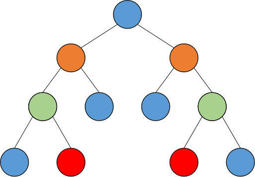
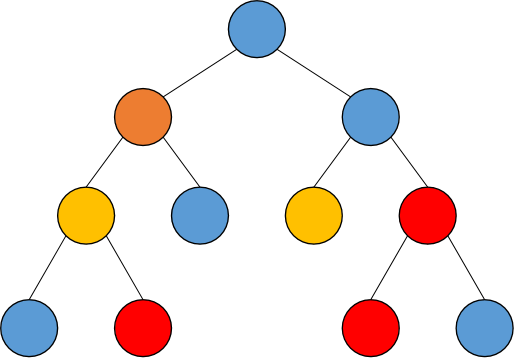
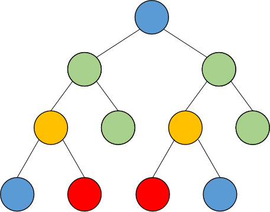

## Description

Cherno and Meursault are drawing binary trees. They are drawing on the same tree, where Cherno draws the nodes which are a left child and Meursault draws the nodes which are a right child. (Root node is already drawn.) Every node is coloured with a color $c_u$. In order to check whether they cooperate well, they want to find a maximum sub-tree which is symmetrical.

Symmetrical binary tree satifies the requirement below:

A binary tree is symmetric, if and only if after the left and right subtrees of all nodes of the tree are swapped, the structure of the corresponding positions of the new tree and the original tree is the same and the point colors are equal.

Note: A tree with only roots is also a symmetrical binary tree. In this problem, it is agreed that a "subtree" with node T as the root of the subtree refers to a binary tree composed of node T and all its descendant nodes.

## Examples of symmetrical binary trees (and not symmetrical)

Here is a example of a symmetrical binary tree:



Here is a example of a binary tree which is not symmetrical due to its color:



Here is a example of a binary tree which is not symmetrical due to its shape:



## Input format

The first line contains a positive integer $n(n\leq 10^6)$, representing the number of nodes for a given tree, specifying the node indexed from $1$ to $n$, where node $1$ is the root of the tree.

The second line contains $n$ positive integers, separated by a space, and the $i$th positive integer $c_i(c_i\leq 1000)$ represents the color of node $i$. 

The next $n$ lines contain two positive integers $l_i$, $r_i$ in $i$-th line, representing the indices of the left and right children of node $i$, respectively. If no left/right child exists, it is represented by -1.

## Output format

The answer contains an integer that represents the number of nodes of the maximum symmetric binary subtree for a given tree.

## Sample Input 1

```
9
5 7 2 3 4 4 7 2 3
2 7
3 -1
4 -1
5 -1
-1 -1
-1 -1
-1 8
-1 9
-1 6
```

## Sample Output 1

```
9
```

## Sample Input 2

Check [sample2.in](file://sample2.in)

## Sample Output 2

Check [sample2.out](file://sample2.out)

## Hint

Cherno whispers to you: Maybe Hash will be useful.

Meursault says that an algorithm takes $o(n\log n)$ time is suitable for $n\leq 10^6$. 

## Compile Directive
```shellscript
g++ foo.cc -o foo -std=c++20 -Wall -Wpedantic -Wextra -Werror -DONLINE_JUDGE -fmax-errors=3 -fdiagnostics-color=always -O2
```