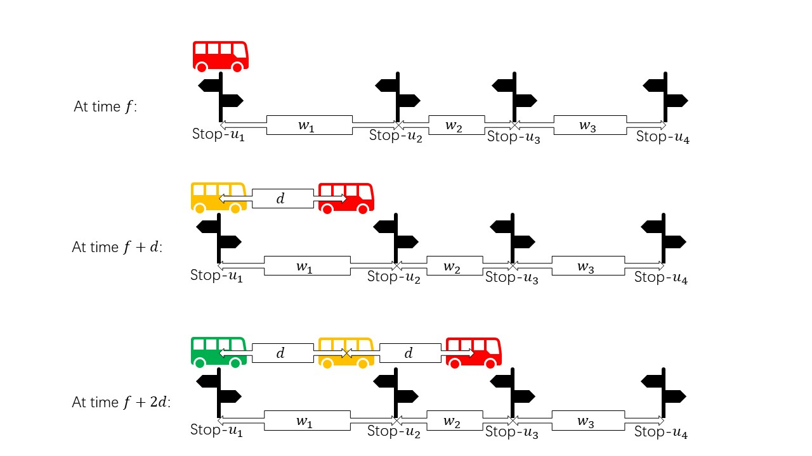

## Problem Description

Zsc2003 lives in Magic City.

There are $n$ bus stops in the city, called Stop-$1$, Stop-$2$, $\cdots$, and Stop-$n$.

And there are $m$ bus routes, called Route-$1$, Route-$2$, $\cdots$, Route-$m$.

Zsc2003 needs the fastest bus plan from $S$ to $T$. He arrives at Stop-$S$ at time $t_0$. Could you help him find out what earliest time he can arrive at Stop-$T$?

## Detailed Setting

Every bus route can be described as follows:

- Every bus passes through $l$ stops in sequence: Stop-$u_1$, Stop-$u_2$, $\cdots$, Stop-$u_l$.
- The travel time intervals between consecutive stops are given by $w_1, w_2, \ldots, w_{l-1}$, where $w_j$ represents the time interval required to travel from Stop-$u_j$ to Stop-$u_{j+1}$.
- The first bus departs from the first stop at time $f$, and every subsequent bus departs at intervals of $d$.
- You can ignore the time when the bus stops at the station. For example, if the bus arrives at Stop-$u$ at time $t$, it can be considered that the bus will leave Stop-$u$ at time $t$.

The following diagram explains these notations for a bus route:

Zsc2003 can be in two states: waiting at a stop or traveling on a bus.

- When waiting at a stop, if a bus arrives at that stop at the current time, he can switch to the traveling state and board the bus immediately.
- When traveling on a bus, if he reaches a stop at the current time, they can switch to the waiting state, get off the bus, and wait at the stop (or finish the journey if reached Stop-$T$).

- A corner case is: if two buses stop at the same stop simultaneously, he can instantly switch between them.

## Input Format

The first line contains $n$, $m$, $t_0$, $S$, and $T$.

The following $3m$ lines describe the bus routes:

- The first line of each route contains $l,f,d$.
- The second line lists the sequence of stops for the route: $u_1, u_2, \ldots, u_l$.
- The third line lists the travel times between consecutive stops for the route: $w_1, w_2, \ldots, w_{l-1}$.

## Output Format

- If it is impossible to reach Stop-$T$ from Stop-$S$, output `-1`.
- Otherwise, output the earliest possible time to reach Stop-$T$.

## Sample1 Input & Output

```input1
5 3 0 4 3
3 0 9
1 2 3
4 5
3 0 9
3 2 1
5 4
5 0 5
5 2 3 4 5
6 6 6 6
```

```output1
36
```

## Sample1 Explanation

| Time Interval | Stop         | State                                     |
| ------------- | ------------ | ----------------------------------------- |
| 0~18          | Stop-$4$     | Waiting                                   |
| 18~24         | Stop-$4\to5$ | Traveling on Route-3                      |
| 24~25         | Stop-$5$     | Waiting                                   |
| 25~31         | Stop-$5\to2$ | Traveling on Route-3                      |
| 31~31         | Stop-$2$     | Instantly switching (Waiting for no time) |
| 31~36         | Stop-$2\to3$ | Traveling on Route-1                      |

## Other Samples

[bus_sample1.in](file://bus_sample1.in)

[bus_sample1.out](file://bus_sample1.out)

[bus_sample2.in](file://bus_sample2.in)

[bus_sample2.out](file://bus_sample2.out)

[bus_sample3.in](file://bus_sample3.in)

[bus_sample3.out](file://bus_sample3.out)


## Constraints

For all Subtasks:

- $n, l \geq 2$
- $1\le n, m,u_j,\sum l\leq 10^6$
- $1\le f, d, w_j \leq 10^9$

| Subtask | Points | Special Constraints                |
| ------- | ------ | ---------------------------------- |
| 1       | 50     | $n, m, \sum l ,f, d, w_j \leq 100$ |
| 2       | 50     | No special constraints             |

## Hint

To get 50 points, the brute-force algorithm for this problem could be DP with time complexity $O(ans\cdot\sum l_i)$, where $ans$ is the answer to this problem if reachable. $dp[u][t]$ means whether he can be at Stop-$u$ at time $t$ (true or false).

To get 100 points, you should come up with a greedy algorithm that is very similar to Dijkstra. $dis[u]$ means the earliest time he can reach Stop-$u$.

The answer may be very large. Please use `long long`.
