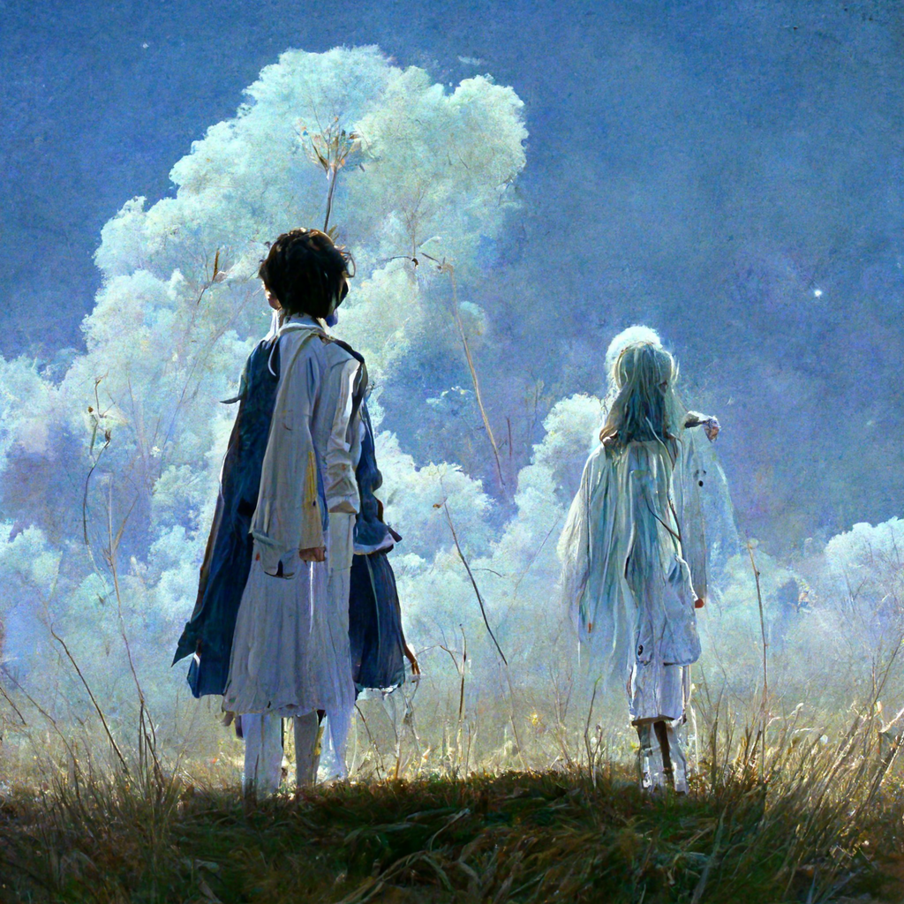

# PA1 Pre-release Version

### Why Pre-release?

Because the OJ is not available now. However, it's a good choice to start programming early and make full use of the holiday. You can read the problem statements, write programs, and preliminary test the correctness locally.


### Pre-reading

[欢迎走进ShanghaiTech CS101](https://mp.weixin.qq.com/s/Ab0mSdIcHBMcivHXzGYNsg) 编程作业小节

[如何编程完成一道算法题](https://mp.weixin.qq.com/s/tXRor1wRlRFZMSbRoVFV_w)


### Note for the Problems

There are 4 problems in PA1:

- Template: An interactive problem. For some technical issues, this problem is not released here temporarily. In this problem you cannot use any STL algorithm or container.
- A, B, C: All of them are traditional problems. You can use all STL algorithms and containers.


### Note for the Constraints and Time Limit

For each problem, we provide several levels of constraints. If your algorithm is not general, or has a high time complexity, you will not pass those testcases with looser constraints.

There is a time limit for each testcase, usually between $1$s and $10$s. Since a common computer can perform $10^8\sim10^9$ basic operations per second, you can estimate the running time of your algorithm by analyzing its time complexity.


### Note for the Input and Output Efficiency

Since the input scale is very large for some testcases, you may need to utilize some better optimization. You could get more information in the WeChat post *如何编程完成一道算法题——特别篇：关于输入*.

We provide an example (in C++) for you:

```cpp
void read(int &x)
{
    auto c=getchar();x=0;
    for(;!isdigit(c);c=getchar());
    for(;isdigit(c);x=(x<<1)+(x<<3)+(c^'0'),c=getchar());
}
```

You can use `read(x)` to read a variable `x`.


## Background

> The background is not relevant to the content of problems and you could definitely skip it.

The world is in its fifth year of being swallowed by the "Cliff of Forgetting".

Only 1/13th of the world's life remains, struggling on the few remaining isolated islands, each race fighting to keep their last spark of civilization alive.

*The First Isolated Island* has always been one of the most mysterious islands. It rarely seems to communicate with the other islands, and the origin of the "First" number is unknown. It is so mysterious that everything about it seems to have been given a special meaning by each race. This is also true for the *primates*, or the former *humans*. They have always treated it as a relic of the human era, the last hope of human rejuvenation on the twin stars.

As if in true response to their expectations, two humans stepped out in the middle of the jungle of *The First Isolated Island*, dilapidated and unfitting for the meaning of the word civilization.

Two ... Perhaps not quite human beings of the human era.

...

"Is this place ... Is this the way it is?"

The maiden plucked away the vine that was wrapped around her face. The reason why using "plucked it away" here is probably because she did just gently pluck it, and the vines slowly retreated as if they were frightened. Her turquoise eyes saw the world for the first time - if she had to write her autobiography, she would have done so.

The sky was unsurprisingly misty. However, the trailing flames of flying machines carrying various colors of fuel streaked everywhere, and the mist that served as a backdrop was not gray, but some kind of bright blue, about the same color as her hair.

She wasn't noticed by anyone. Everything didn't concern her, they flowed unconcernedly. Maybe there was something else that was distorted, and she didn't care.

"Are we going right? Is it going that way?"

The lad looked to her left. A branch flew in front of his eyes, from nowhere. He looked at her too.

"Your hair, it seems to have dissolved."

"Oops, purely by accident."

The maiden patted the back of her head awkwardly, her long blue hair precipitating back out of her white shirt. The lad's dark blue with white wizard robes looked much plainer.

"I just had a look at the seismograph and it doesn't feel like anything is wrong."

Their feet were still submerged in the grass; it was black, or at least the shade of black had been covering them. And there was the maiden's hair.

"But the stratum ... really doesn't go very well."

"Isn't that a job you're good at? Don't ask me for help."

The lad nodded.

There was another gust of wind. The cloud seemed to be there since the beginning.



*\*Created by MidJourney.* 
